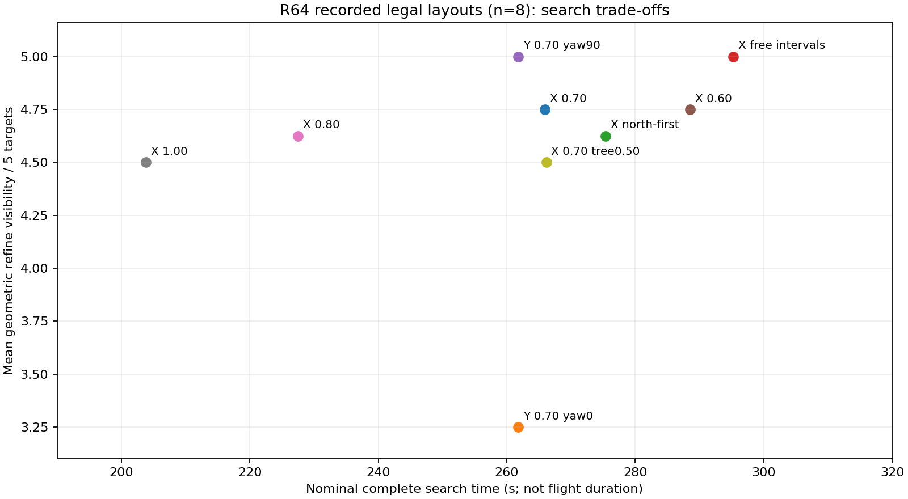
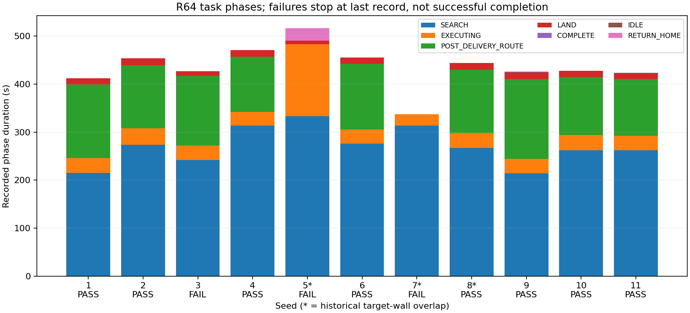

# R64后时间优化、轻量仿真适配与辅助相机评估计划

2026-09-09。执行范围：rqt图更新、已有数据的离线分析、本地清理；时间优化、辅助相机与轻量仓功能改造只做计划。本次没有启动SITL、改飞行参数、启用辅助相机或安全返航，也不重打飞行包。任务优先级只在[ROADMAP](https://github.com/Qinling-Melon-Farmers/liftrace-visionwork/blob/feat/r2026-competition-integrated/VISION_2026_ROADMAP.md)维护。

结论：优先减少搜索绕行与无效等待，保留已验证的恢复和低走廊控制。辅助相机可以重新评审，但尚无证据表明比单相机航路优化更划算。轻量仓适合筛选候选，不能给出实机全局最优或PASS概率。以下区分实录、几何估算和待验证目标。

## 1. 前期计划与事实基线

用户提到的前期分析是轻量仓R61的`data/recorded_fields/SEARCH_COMPARISON.md`、`docs/ENGINEERING_REVIEW_20260909.md`，以及从R62/R63追加到R64的[SEARCH_RETURN_PLAN](../SEARCH_RETURN_PLAN_20260909.md)。R60十seed仅2/10完整PASS，不能与新地图R64混算。

R64固定seed11完整37/37 PASS，十seed原始7/10完整PASS、8/10三投。旧5/7/8靶板压墙，原记录保留。本次离线合法布局组为1/2/3/4/6/9/10/11共8组，包含飞行失败的seed3；不把筛选后的数据称为新十seed成功率。

场内净9.6m，搜索航点范围X[-4.3,4.3]/Y[0,7.1]，面积61.06m²；靶板可布设搜索区更大，约X[-4.8,4.8]/Y[-0.5,7.6]，需扣除墙/树箱和边缘包络。因此24航点到达不等于自由区域全覆盖。名义搜索FC AGL1.40m，光心1.24m；相机FC下16cm、IMU下21cm、落地镜头离支撑面6cm，机体50×50×37cm，仿真包络55×55×40cm。两门仅左右、净宽0.80m，低廊配置本次不改。

障碍柱已有实现，高度变化与在线有效覆盖仍待验证。更高巡航仍须遵守已核对的“全程高于障碍”等得分限制，不能因虚拟柱化而自动取得避障分。本次不改高度。

## 2. 时间消耗与优化对象

重新读取11轮`key_events.jsonl`，按任务阶段分段：[phase_timing.json](phase_timing.json)。SEARCH含该阶段移动、绕障和等待；EXECUTING含接近/捕获/投递及恢复。状态时长不是算法计算耗时。

| 阶段 | seed11实录s | 合法成功7轮中位s | 后续优化对象 |
|---|---:|---:|---|
| SEARCH | 262.228 | 262.228 | 可达端点、有效覆盖、候选发现与重复路段 |
| EXECUTING | 29.937 | 29.980 | 捕获等待；保留已稳定的2–3s恢复，不放松许可 |
| POST_DELIVERY_ROUTE | 118.782 | 131.674 | 分别分析回入口、下降、过门、H接近，不统一提速 |
| LAND阶段 | 11.768 | 13.301 | 优先解决seed3近地失败，不用空中停机节时 |

各阶段中位数不能直接相加当整场中位。seed11任务管理器启动→disarm为424.093s；原Gate的422.712s截止任务完成，约1.38s差异来自终点定义，原PASS记录不改。实际裁判指令到启动的计时仍须另接，不能把管理器时钟当官方计时。

原报告8个成功样本（包含seed8非法布局）投后路线→disarm为128.830–181.580s，中位146.235s；LAND交接→disarm为12.930–15.389s。最后十几秒不能代表整个返程预算，未完成返程的失败不能填0秒。

计划先拆分规划计算、不可达重试、端点停顿、视觉未捕获与正常飞行。占据端点可按自由区间调整，登记遗漏并补扫，避免同一点反复耗尽90s。安全接近点切入视觉捕获时要保持净空，避免之后追向贴墙原始点。以上均待未来实现，不降低超时、稳定帧数、净空或碰撞判据。

## 3. 轻量仓适配与离线策略结果

本地fork版本`0708b8650beb6f9e43b35541c3e67e616b69e624`已有R64实录11轮、16/21cm刚性安装、约1Hz完整姿态、0.80m四门组合和树箱随机导出。R64默认墙/树箱与R61几何一致，本次使用R64实际靶位/墙重新整理输入，沿用已核对的名义树箱。未拿R60旧受限靶位替代新场地。

本次只调用已有`recorded_search_replay.build_route/evaluate_route`及`installed_camera`，未改轻量仓算法文件。最新适配是实录/几何层；旧M0/M2的2.4/3.4m、自动朝航迹转头、高空直飞绕障近似、假设Cue概率仍不适用于今年整机预测。

轻量仓61项现有单元测试通过。本次新增的是计划附件，未实施后述功能。

输入与结果：[布局](r64_geometry_input.json)、[CameraInfo](camera_info.json)、[10种组合×11布局](geometry_comparison.json)。假设：准确静态地图、0.30m点路径膨胀、0.05m A*栅格、FC AGL1.40m、速度0.50m/s、转折1s、10Hz采样、连续可见0.20s、固定姿态。树冠用半边0.40m方形近似，另测0.50m。路线生成不读目标坐标，目标真值只用于评测。

| 路线/固定yaw | 航带m | 名义全搜索s | 合法8组平均精修几何可见/5 | 第三个中心可见中位s |
|---|---:|---:|---:|---:|
| X牛耕+端点调整/A*，yaw0 | 0.70 | 265.93 | 4.750 | 102.20 |
| Y牛耕+端点调整/A*，yaw0 | 0.70 | 261.78 | 3.250 | 117.36 |
| X北侧优先，yaw0 | 0.70 | 275.40 | 4.625 | 112.13 |
| X自由区间分段，yaw0 | 0.70 | 295.29 | 5.000 | 124.54 |
| Y牛耕+端点调整/A*，yaw90 | 0.70 | 261.78 | 5.000 | 93.51 |
| X牛耕+端点调整/A*，yaw0 | 0.60 | 288.55 | 4.750 | 118.14 |
| X牛耕+端点调整/A*，yaw0 | 0.80 | 227.46 | 4.625 | 96.45 |
| X牛耕+端点调整/A*，yaw0 | 1.00 | 203.79 | 4.500 | 84.95 |

原始不绕障直线牛耕不可行，只作对照。“精修几何可见”沿用工具中心+四极点/角点入画及五点至少三点无遮挡近似，不等于完整环像素通过检测，也不等于三投/全场自由区覆盖。三中心可见未计类别价值、投递中断、抵近和恢复成本。





有限候选内Y/yaw90平均5/5可见，名义全搜索比X/yaw0少4.15s；但第三中心最慢样本152.42s，比X/yaw0的113.24s更差，不能只看中位数宣称最优。0.80m间距少38.47s（14.5%）名义全搜索，精修几何可见略降；1.00m少62.14s（23.4%），可见性进一步下降。树冠半边改0.50m，X/0.70m的平均精修可见也降到4.50/5。

后续保留三类候选：X/0.70m保守基线；X/0.80m加遗漏补扫；与视场方向匹配的Y/yaw90对照。自由区间先用作局部补扫。综合三投成功、零碰撞、尾部时间与得分选型。本批已用于分析，正式验证需新的合法布局及未参与选型的holdout。

轻量仓后续改造计划（均未实施）：

1. 统一实录、生成器与策略的schema，记录地图/目标/门/树箱seed，对旧M0/M2明确版本，避免旧默认值回流。
2. 按实际姿态、高度和刚性外参投影视锥到地面自由区，加入墙/树遮挡与图像质量，累计实际覆盖并补遗漏；航带不只按名义高度固定。
3. 加入发现→确认→接近→捕获→投递→恢复时序和实录等待分布，保留失败/截尾；不只用成功样本拟合。
4. 分离搜索粗发现与末端严格精修，比较候选访问顺序及安全入口；飞行策略不得使用未观测真值靶位。
5. 辅助相机使用独立K/D、完整刚性TF、曝光与实测检出/误报、共享RKNN调度延迟；未知项做敏感性区间。

这些升级不能代替真实点云随机门SITL或实机验收，本次没有实现它们。

## 4. 辅助相机重新评审

V-EXP-01于2026-08-23冻结，原型分支仍在：`feat/oblique-camera-search-feasibility@b60a4d9`、`feat/oblique-active-search-stability@ab6e447`、`feat/oblique-aux-proposal-provider@3f2e55a`。粗投影、匿名候选、下视交接已有原型；真实斜视YOLO、单runtime双输入、板端带宽/功耗、随机A/B未完成。旧三轮3/3时辅助激活为0，“21%节时”来自四点稀疏航线；强制两候选2/2交接却增加航程与时间。不能把旧原型整体合回。

本次按用户要求恢复的是方案评审，主线仍单下视。建议辅助相机只作早发现和排序，下视继续确认目标身份/中心、投递和H降落；辅助候选不直接放行舵机。先比较低频单目斜下RGB，不默认加深度或复制第二套完整精修链。

R64实录SEARCH、AGL≥0.8m、速度≥0.2m/s筛选：seed11航迹与机头夹角中位110.81°，59.2%超过30°；各seed中位约91.6–122.1°，[数据](search_heading.json)。固定前斜相机随机体刚性运动，侧飞/倒飞时不会自行朝航迹前方。需对比固定yaw与安全换带点转yaw，把转向耗时、旋转包络、主相机长短边交换计入；不为辅助相机改变走廊/投递/降落的已有航向策略。

辅助型号、内参、安装尚未确定。仅举几何例子：光心高1.24m、相对竖直下视向前倾35°，光轴地面落点前移约0.87m（h·tanβ），不是识别距离或节时收益。远端透视、遮挡、曝光和模糊都会影响检出。旧45°/55°/60°实验必须先统一相对水平/竖直定义。

未来最小实施路径：读旧候选/交接设计并适配今年接口与实测标定；斜视录像标注，测真实误检漏检；单RKNN双源shadow调度；相同合法布局、路线、高度、速度下做启用前后对照。与随机门/树箱单因素分开，确保能定位收益来源。

## 5. 计算资源需求与预算

R64整机尚无OrangePi CPU/RSS/NPU占用曲线。本次不连接板子或启动硬件节点，不能把RTX结果或单模型离线测试称为板端并发达标。

历史依据：主集成/原基线`docs/板端推理性能对比报告_20260810.md`。统一六分类FP32 RKNN推理p50 54.8ms、总处理p50 62.1ms、约16fps；旧双模型总处理163.7ms约6fps。当时INT8约21fps但零检测，不作为有效提速方案。16fps低于相机20–30fps采集率，目标检测5–10Hz与相机采集率应区分。该历史测试未包含当前LIO/FreeDOM/Planner/ROS竞争与持续温升。

| 项目 | 当前单下视 | 辅助方案预算（未实测） |
|---|---|---|
| LIO/FreeDOM/规划 | CPU+内存，维持几何精度/周期 | 保持，不为相机粗化门地图或减少净空 |
| 神经网络 | 单FP32 RKNN，实际整机检测率待测 | 单runtime复用；搜索比较下视5Hz+辅助3Hz或8Hz+3Hz；对准/投递/降落暂停辅助 |
| OpenCV几何 | 主相机圆环/十字/H，多节点图像输入 | 辅助仅低频粗候选，不复制完整精修链 |
| CPU/RSS | 当前并发实测缺失 | 测每节点/阶段CPU、RSS、图像年龄后定频率 |
| 显示/记录 | 板端debug/全场录像默认关 | 不把常开GUI或全场编码列为辅助上线依赖 |

用历史62.1ms总处理时间估算串行工作量：8帧/s需0.497秒处理时间/秒，11帧/s需0.683秒，双10Hz共20帧/s需1.242秒，已超历史吞吐。这不是CPU占用率或真实NPU利用率；p50不能代替P95，竞争/温升还会减少余量。现有`target_detector_rknn.py`只有一个图像订阅，双源调度需未来实现。queue_size=1不能自动解决融合缺源等待或跨相机身份关联。

ROS解码RGB8数据量：1280×720每帧2.76MB，20Hz为55.30MB/s；辅助640×360、10Hz增加6.91MB/s，合计62.21MB/s。若辅助也是1280×720、20Hz，则合计110.59MB/s。这是一次图像流有效载荷，ROS进程间复制会放大内存流量；USB线上MJPEG/YUYV格式、解码CPU、控制器共用需另测，不能用RGB数替代USB占用。

内存主要压力还包括地图：共享`horizontal_planner.yaml`为12×22×3m、5cm，共6,336,000体素；`sdf_map.cpp`主要常驻数组56字节/体素，约354.8MB（338.4MiB），不含LIO树、FreeDOM点云、搜索、ROS和NPU工作区。硬件应用也加载此配置。主图一帧约2.64MiB，辅助640×360约0.66MiB；640×640×3 float32输入约4.69MiB/份。RKNN内存不能只看模型文件大小；先测单runtime复用，暂不直接跑两个独立实例。本次不调内存/线程参数。

未来记录：LIO/地图周期、规划耗时、控制发布间隔、主辅推理P50/P95/P99、源图到候选时延、融合缺源等待、TF年龄、CPU各核/RSS/NPU/温度和USB丢帧。先满足主相机对准时延，再分辅助预算；不得产生持续积压、控制更新超期或错误重复候选。上述为计划，未新增飞行限制。

## 6. 收益与未来对照设计

辅助净收益＝提前发现节省的搜索时间－新增转向/访问/误报核实时间－计算等待。seed11 SEARCH为262.228s；若假设其中20%可消除，约52.45s只是未扣成本的潜力示例，不是预测收益。辅助不能消除118.8s投后路线或seed3近地失败，也不能重复领取同一段稀疏航线收益。

后续A保留R64单下视；B只改可达覆盖；C在B同路线/航向下开辅助shadow；D才允许辅助候选影响现有任务排序。配对新的合法布局，保留全部失败，比较三投率、首次/第三次释放时间、完整任务P50/P90/最大值、无碰撞和得分；少样本报告原始值，避免夸大尾部统计。

可将“扣除新开销后中位任务时间改善≥10%，失败/碰撞不增加”列为继续投入的候选标准，待未来试验规模确定；未达到则保留单下视。不能据本次十组合几何结果称最优比赛策略。

安全返航保持关闭：early_return_enabled=false，420秒提前返回与450/150提案均不启用，600秒总时限保留。未三投回起飞H、三投后走廊H的规则解释和分线路预算继续由原SEARCH_RETURN_PLAN维护，本次只补计时证据。

## 7. 复现和交付边界

在已有Python环境、轻量仓目录可用原工具复现默认五路线：

```bash
python recorded_search_replay.py \
  --scene /path/to/integrated/docs/planning/r64_time_camera/r64_geometry_input.json \
  --camera /path/to/integrated/docs/planning/r64_time_camera/camera_info.json \
  --output /path/to/integrated/logs/offline_search_comparison
```

其他间距调用原`build_route(...spacing=...)`，固定yaw调用原`quaternion_from_rpy`；全部假设/组合已在JSON。本次分析脚本留本地`logs/_artifacts/r64_topology_plan_20260909/`，不作为新轻量算法接入。仅提交图、离线绘图工具修正、分析附件和计划；飞行包仍是R64源码。
